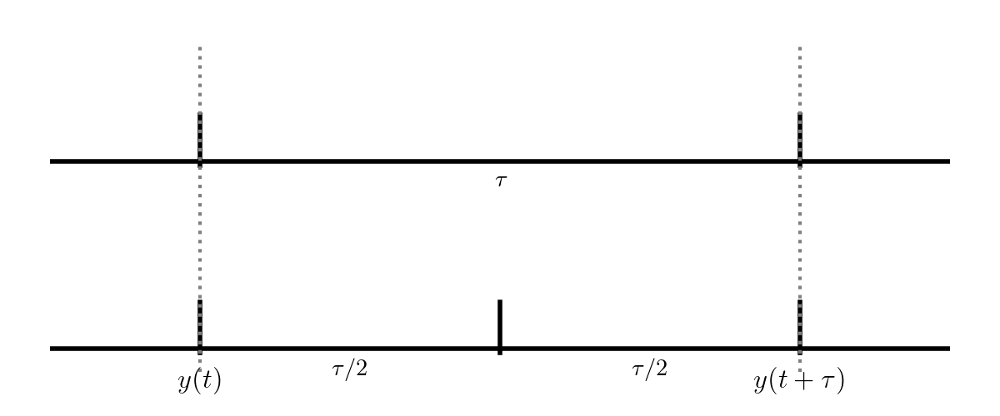

Adaptive Timesteps
==================

So far we've been integrating with a fixed timestep.  This gives us no real control over the error.  What we would like to do is take a small timestep when the solution is changing fast, and a larger timestep when the solution changes more slowly.

To do this, we need to be able to assess the error in our solution as we integrate.  There are lots of different
ways to do this in the literature:

* Take two half steps and compare to one full step
* Compare higher and lower order methods (sometimes the lower order method is _embedded_ in the higher-order  method,
  for instance this is the [RK45 method used by SciPy](https://en.wikipedia.org/wiki/Dormand%E2%80%93Prince_method))

We'll do the first method here, as it is the simplest.  Consider integrating
a function $y(t)$ through some timestep $\tau$:



The top evolution takes a single step of size $\tau$ while the bottom takes
two steps each of $\tau/2$.  These two integrations both end at $y(t+\tau)$,
but we expect the one that took 2 half steps to be more accurate (since the truncation error is smaller).

Now, we know that RK4 is _locally_ 5th order accurate, so that means that
for our single step, the error will be:

$$\epsilon \sim \tau^5$$

And imagine that we wanted to achieve an error of $\epsilon_\mathrm{want}$&mdash;
there is a timestep $\tau$ that would get this:

$$\epsilon_\mathrm{want} \sim \tau_\mathrm{est}^5$$

If we take the ratio of these, then any proportionality cancels, and we have

$$\tau_\mathrm{est} = \tau \left (\frac{\epsilon_\mathrm{want}}{\epsilon} \right)^{1/5}$$

If we were not accurate enough, this would predict a finer timestep that would
give us our desired accuracy.  And if we were too accurate, then this would
tell us how much we could increase the timestep while maintaining our desired
accuracy.

Let's consider doing this with RK4.  Our approach will be:

1. Integrate from $y(t)$ to $y(t+\tau)$ using a single timestep, $\tau$.

   Call the solution $y^\mathrm{single}$
   
2. Integrate from $y(t)$ to $y(t+\tau)$ using two steps of size $\tau/2$.

   Call the solution $y^\mathrm{double}$
   
3. Compute an estimate of the _relative error_ in the solution as:

   $$\epsilon_\mathrm{rel} = \left | \frac{y^\mathrm{double} - y^\mathrm{single}}{y^\mathrm{double}} \right |$$
   
4. Compute the timestep that would give us our desired accuracy, $\epsilon_\mathrm{want}$:

   $$\tau_\mathrm{est} = \tau \left (\frac{\epsilon_\mathrm{want}}{\epsilon_\mathrm{rel}} \right)^{1/5}$$

5. If $\epsilon_\mathrm{rel} < \epsilon_\mathrm{want}$ then our timestep
   was good, and store the solution at time $t + \tau$ as $y^\mathrm{double}$.
   Increase the timestep according to $\tau_\mathrm{est}$ for the next step.
   
   If $\epsilon_\mathrm{rel} > \epsilon_\mathrm{want}$ then throw away our
   solution and go back to $y(t)$ and retry the integration with the new, smaller
   $\tau_\mathrm{est}$.
   
In practice, we usually limit the amount that the timestep can change from one
attempt to the next by a factor of $\sim 2$ or so.

```{note}
For a different method, the timestep estimate will likely be different, since
it depends on the scaling of the local truncation error with the timestep, $\tau$
```

