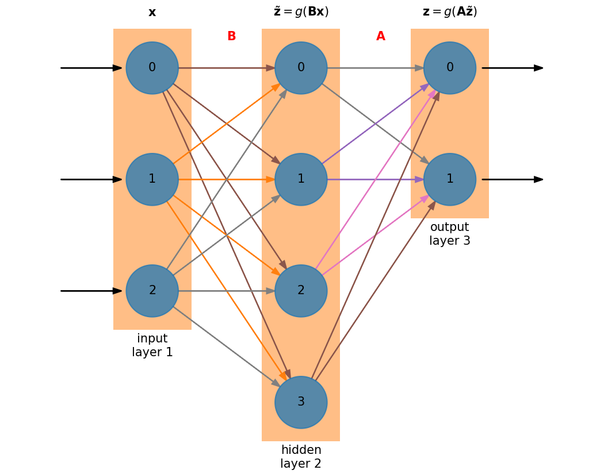

# Hidden Layers


 We can get better performance from a neural network by adding a hidden layer:



The size of the hidden layer is independent of the size of the input and output
layers.  In this case, we have a hidden layer that is larger
than either the input or output layers.

Now we have an additional matrix ${\bf B}$ to train.  The matrix sizes are:

* ${\bf A}$ : $N_\mathrm{out} \times N_\mathrm{hidden}$
* ${\bf B}$ : $N_\mathrm{hidden} \times N_\mathrm{in}$


```{note}
Neglecting the activation functions, the action of the network
is to do ${\bf z} = {\bf A B x}$ which has size $N_\mathrm{out}$.
```

The derivation of the corrections to matrices ${\bf A}$ and ${\bf B}$ can be done
via the chain rule.

```{info}
We'll consider the case of a single hidden layer, but the derivation we
do here generalizes to multiple hidden layers.
```

$$f(A_{lm}, B_{ij}) = \sum_{l=1}^{N_\mathrm{out}} (z_l - y^k_l)^2$$

$$\tilde{z}_i = g \left ( \sum_{j=1}^{N_\mathrm{in}} B_{ij} x^k_j \right )$$

$$z_l = g \left ( \sum_{m=1}^{N_\mathrm{hidden}} A_{lm} \tilde{z}_m \right )$$

Note that we are assuming here that the same activation function, $g(\xi)$
is used on each layer.

## Updates to ${\bf A}$

Matrix ${\bf A}$ is trained based on the output layer, we know the error there
directly, ${\bf e}^k = {\bf z} - {\bf y}^k$.  As a result, we can just use
the result that we got for a single layer, but now the input is $\tilde{\bf z}$
instead of ${\bf x}$:

$$\frac{\partial f}{\partial {\bf A}} = 2 {\bf e}^k \circ {\bf z} \circ (1 - {\bf z}) \cdot \tilde{\bf z}^\intercal$$

## Updates to ${\bf B}$

To find the corrections to matrix ${\bf B}$, we essentially need to know what the
error is on the hidden layer.  But we only know the error on the output layer, so
by applying the chainrule on our cost function, we will work out this correction,
and in the process see how the error on the output layer informs the error on the
hidden layer&mdash;a process called _backpropagation_.

Let's start with our cost function:

$$f(A_{lm}, B_{ij}) = \sum_{l=1}^{N_\mathrm{out}} (z_l - y^k_l)^2$$

Differentiating with respect to an element in matrix ${\bf B}$, we have:

$$\frac{\partial f}{\partial B_{pq}} = 2 \sum_{l=1}^{N_\mathrm{out}} (z_l - y_l^k)
    \frac{\partial z_l}{\partial B_{pq}}$$
    
Now we cosider $\partial z_l/\partial B_{pq}$ using the chain rule:

$$\frac{\partial z_l}{\partial B_{pq}} = \frac{\partial}{\partial B_{pq}}
   \left [g \left ( \sum_{m=1}^{N_\mathrm{hidden}} A_{lm} \tilde{z}_m \right ) \right ]
     = \frac{\partial g(\tilde{b}_l)}{\partial B_{pq}}$$
     
where we defined

$$\tilde{b}_l = \sum_{m=1}^{N_\mathrm{hidden}} A_{lm} \tilde{z}_m$$

such that $z_l = g(\tilde{b}_l)$.  Continuing with the chain rule:

$$\frac{\partial z_l}{\partial B_{pq}} = \left . \frac{\partial g}{\partial \xi} \right |_{\xi = \tilde{b}_l} \frac{\partial \tilde{b}_l}{\partial B_{pq}} = z_l (1 - z_l)\frac{\partial \tilde{b}_l}{\partial B_{pq}} $$

where we used the derivative of the activation function that we previously computed.

Now the next derivative:

$$\frac{\partial \tilde{b}_l}{\partial B_{pq}} = \sum_{m=1}^{N_\mathrm{hidden}} A_{lm} \frac{\partial \tilde{z}_m}{\partial B_{pq}}$$

using

$$\tilde{z}_m = g\left ( \sum_{j=1}^{N_\mathrm{in}} B_{mj} x^k_j \right )$$

and taking 

$$b_m = \sum_{j=1}^{N_\mathrm{in}} B_{mj} x^k_j$$

such that $\tilde{z}_m = g(b_m)$, we have:

$$\frac{\partial \tilde{z}_m}{\partial B_{pq}} = \frac{\partial g(b_m)}{\partial B_{pq}}
  = \left . \frac{\partial g}{\partial \xi} \right |_{\xi = b_m} \frac{\partial b_m}{\partial B_{pq}} = \tilde{z}_m (1 - \tilde{z}_m) \frac{\partial b_m}{\partial B_{pq}}$$
  
and now the last derivative:

$$\frac{\partial b_m}{\partial B_{pq}} = \sum_{j=1}^{N_\mathrm{in}} \frac{\partial B_{mj}}{\partial B_{pq}} x^k_j = \sum_{j=1}^{N_\mathrm{in}} \delta_{mp} \delta_{jq} x^k_j = \delta_{mp} x^k_q$$

Putting this all together, we have:

\begin{align*}
\frac{\partial z_l}{\partial B_{pq}} 
  &= z_l (1 - z_l) \sum_{m=1}^{N_\mathrm{hidden}} A_{lm} \tilde{z}_m (1 - \tilde{z}_m) \delta_{mp} x^k_q \\
  &= z_l (1- z_l) A_{lp} \tilde{z_p} (1 - \tilde{z}_p) x^k_q
\end{align*}

and

$$\frac{\partial f}{\partial B_{pq}} = \sum_{l=1}^{N_\mathrm{out}}
   2 \underbrace{(z_l - y_l^k)}_{ = e_l^k} z_l (1 - z_l) A_{lp} \tilde{z}_p (1 - \tilde{z}_p) x^k_q$$
   
Now, that remaining sum is contracting on the first of the indices of
the matrix ${\bf A}$, indicating a matrix vector product involving
${\bf A}^\intercal$.  Let's define:

$$\omega^k_l = e^k_l z_l (1 - z_l)$$

then we can define the error backpropagated to the hidden layer as:

$$\tilde{e}^k_p \equiv \sum_{l=1}^{N_\mathrm{out}} \omega^k_l A_{lp} = ({\bf A}^\intercal {\boldsymbol \omega}^k)_p$$

and we can write

$$\frac{\partial f}{\partial {\bf B}} = 2 \tilde{\bf e} \circ \tilde{\bf z} \circ (1 - \tilde{\bf z}) \cdot ({\bf x}^k)^\intercal$$

```{note}
It seems that a common approximation is to take:

$$\tilde{\bf e} = {\bf A}^\intercal {\bf e}$$

absorbing the rest of the terms in ${\boldsymbol \omega}$ into the weights of
the matrices we are training.
```

Notice the symmetry in the update of each matrix:

\begin{align*}
\frac{\partial f}{\partial {\bf A}} &= 2 {\bf e}^k \circ {\bf z} \circ (1 - {\bf z}) \cdot \tilde{\bf z}^\intercal \\
\frac{\partial f}{\partial {\bf B}} &= 2 \tilde{\bf e} \circ \tilde{\bf z} \circ (1 - \tilde{\bf z}) \cdot ({\bf x}^k)^\intercal
\end{align*}

Adding additional hidden layers would continue the trend, with each hidden layer's matrix update depending
on the error backpropagated to that layer.
